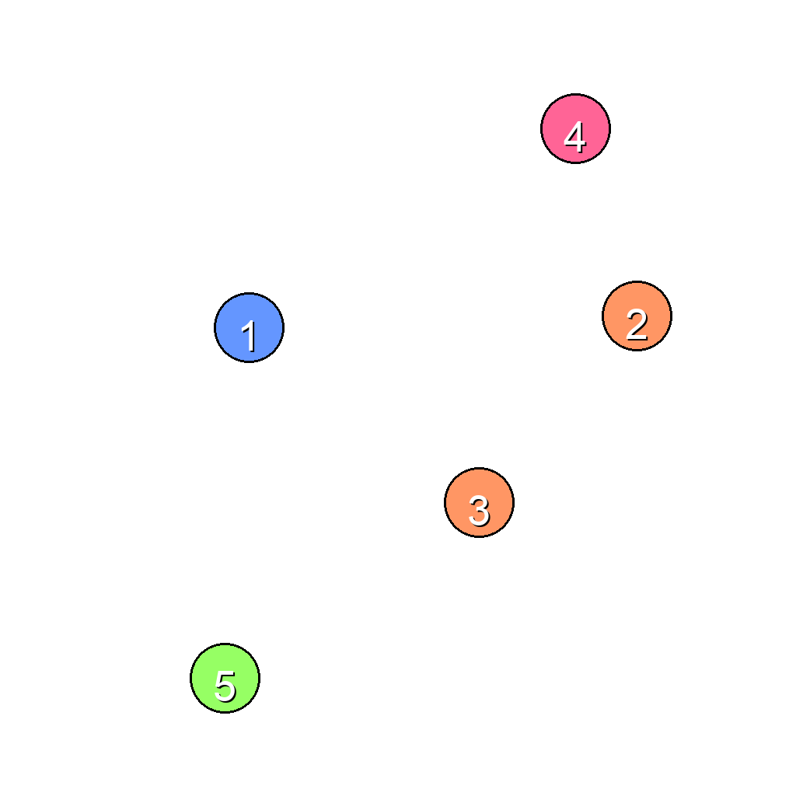
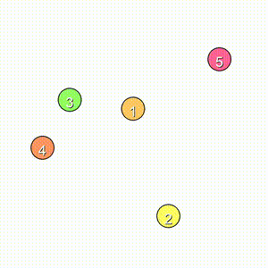
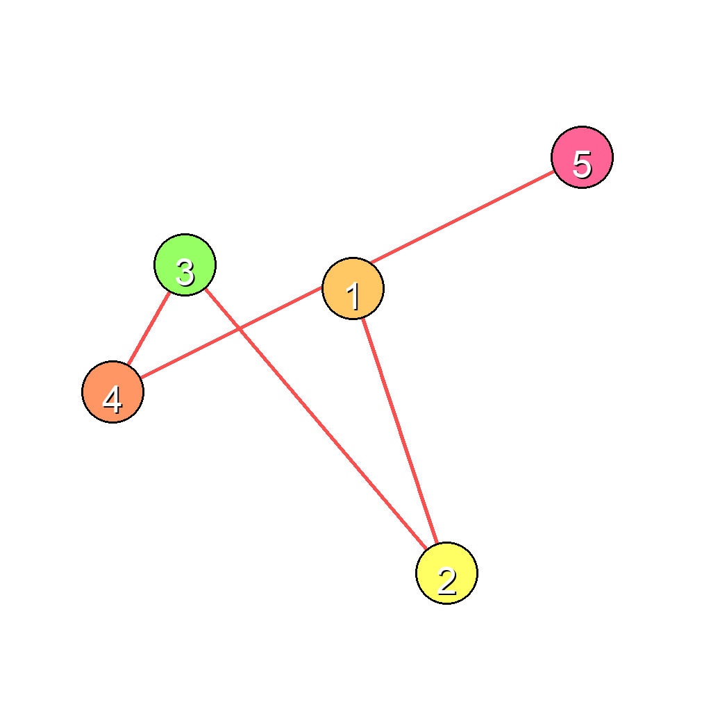

# O-34: Dot-to-Dot Task Data Generator

Generates synthetic sequential reasoning tasks where numbered dots need to be connected in numerical order. The task requires drawing straight lines between consecutive dots to complete the pattern.

Each sample pairs a **task** (first frame + prompt describing what needs to happen) with its **ground truth solution** (final frame showing the result + video demonstrating how to achieve it). This structure enables both model evaluation and training.

---

## 📌 Basic Information

| Property | Value |
|----------|-------|
| **Task ID** | O-34 |
| **Task** | Dot-to-Dot Connection |
| **Category** | Sequential Reasoning/Pattern Completion |
| **Resolution** | 1024×1024 px |
| **FPS** | 16 fps |
| **Duration** | Variable |
| **Output** | PNG images + MP4 video |

---

## 🚀 Usage

### Installation

```bash
# Clone the repository
git clone https://github.com/VBVR-DataFactory/O-34_dot_to_dot_task_data-generator.git
cd O-34_dot_to_dot_task_data-generator

# Install dependencies
pip install -r requirements.txt
```

### Generate Data

```bash
# Generate 100 samples
python examples/generate.py --num-samples 100

# Generate with specific seed
python examples/generate.py --num-samples 100 --seed 42

# Generate without videos
python examples/generate.py --num-samples 100 --no-videos

# Custom output directory
python examples/generate.py --num-samples 100 --output data/my_output
```

### Command-Line Options

| Argument | Type | Description | Default |
|----------|------|-------------|---------|
| `--num-samples` | int | Number of samples to generate | 100 |
| `--seed` | int | Random seed for reproducibility | Random |
| `--output` | str | Output directory | data |
| `--no-videos` | flag | Skip video generation | False |

---

## 📖 Task Example

### Prompt

```
The scene shows 5 numbered dots scattered across the image. Connect the dots in numerical order (1→2→3→4→5) by drawing red straight lines between them, one line at a time in sequence.
```

### Visual

<table>
<tr>
  <td align="center"></td>
  <td align="center"></td>
  <td align="center"></td>
</tr>
<tr>
  <td align="center"><b>Initial Frame</b><br/>Numbered dots scattered on canvas</td>
  <td align="center"><b>Animation</b><br/>Lines drawn sequentially connecting dots</td>
  <td align="center"><b>Final Frame</b><br/>All dots connected in order</td>
</tr>
</table>

---

## 📖 Task Description

### Objective

Connect numbered dots in sequential order by drawing straight lines between consecutive dots, creating a continuous path from dot 1 to the final dot.

### Task Setup

- **Multiple Dots**: 4-8 numbered dots scattered across the canvas (varies per task)
- **Dot Properties**: Radius 45 pixels, numbered from 1 to N
- **Line Properties**: Width 5 pixels, bright red color for visibility
- **Number Display**: White numbers on dots for clear identification
- **Color Variety**: Random colors for dots from a vibrant palette
- **Sequential Connection**: Lines drawn in strict numerical order
- **Scattered Layout**: Dots positioned randomly across canvas

### Key Features

- **Sequential reasoning**: Tests ability to follow numerical order
- **Number recognition**: Identifying and ordering numbered elements
- **Path planning**: Understanding how to connect discrete points
- **Line drawing**: Creating straight lines between points
- **Order dependency**: Must connect in correct sequence
- **Visual tracking**: Following numbered sequence across space
- **Completion verification**: Ensuring all consecutive pairs are connected
- **Step-by-step execution**: Drawing one line at a time in order

---

## 📦 Data Format

```
data/dot_to_dot_task/
├── dot_to_dot_0000/
│   ├── first_frame.png          # Initial state (numbered dots)
│   ├── final_frame.png          # Final state (dots connected)
│   ├── prompt.txt               # Task instructions with dot count
│   └── ground_truth.mp4         # Solution video (16 fps)
├── dot_to_dot_0001/
│   └── ...
```

**File specifications**: Images are 1024×1024 PNG. Videos are MP4 at 16 fps, variable duration based on number of connections.

---

## 🏷️ Tags

`sequential-reasoning` `pattern-completion` `number-ordering` `path-planning` `line-drawing` `visual-tracking` `order-dependency`

---
